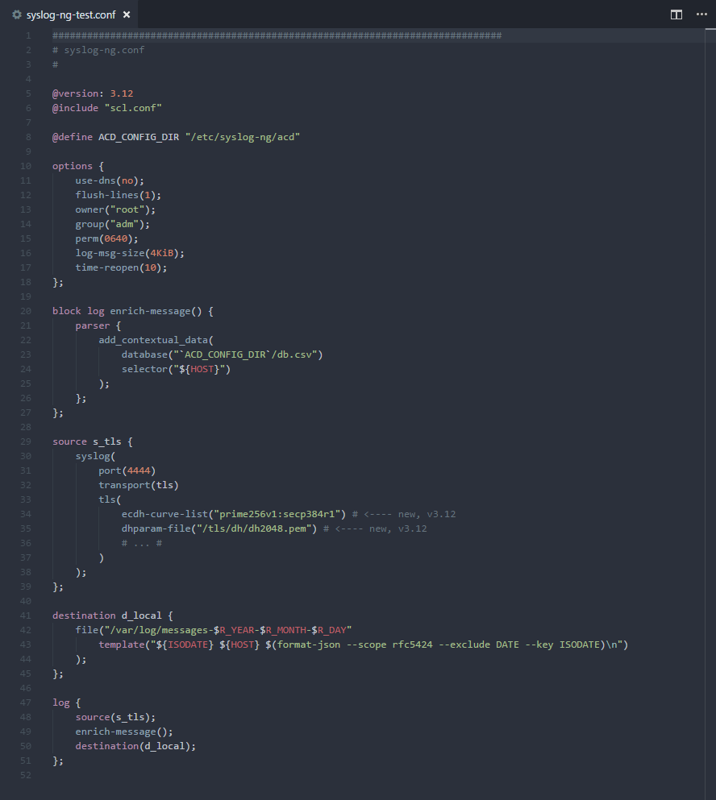

# syslog-ng configuration syntax for Visual Studio Code

## Installation

In the command palette (`cmd-shift-p`) select Install Extensions and search for `syslog-ng`.
Once the extension is installed, reload VSCode.

